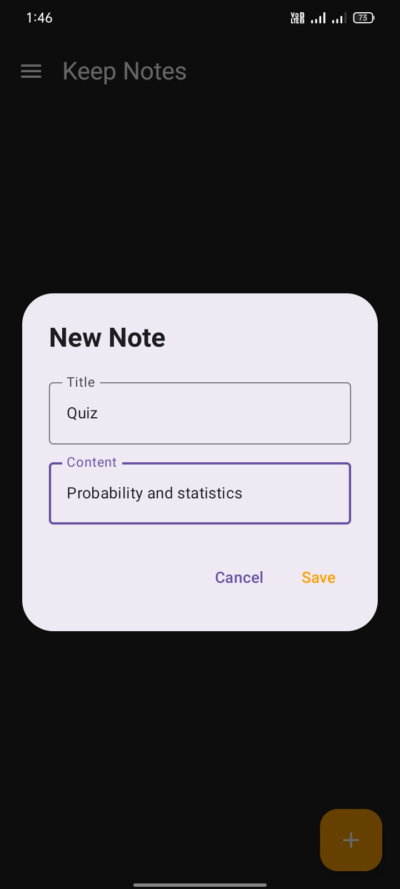
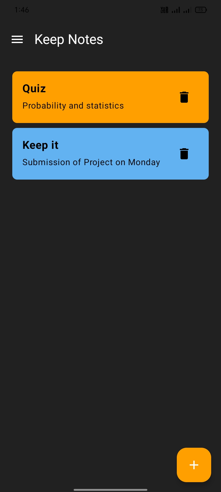
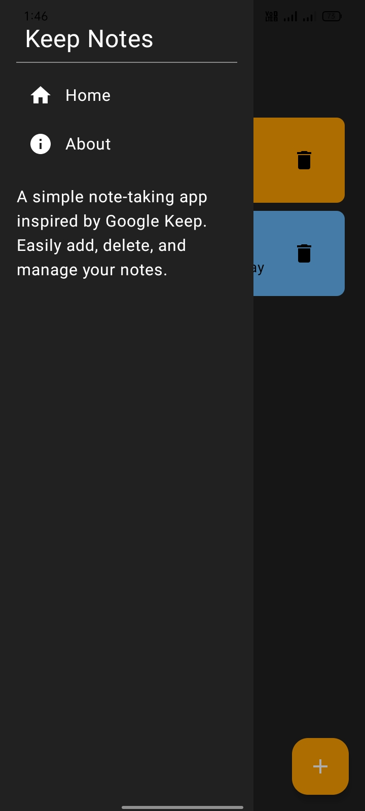

# Keep Notes - A Simple Note-Taking App

## Overview
My first one-day android app.
**Keep It** is a simple and elegant note-taking app inspired by Google Keep. It allows users to add, delete, and manage notes efficiently with a clean UI built using **Jetpack Compose**.

## ✨ Features
- 📝 **Create and manage notes** effortlessly
- 🗑️ **Delete notes** with a single tap
- 🎨 **Minimalistic dark-themed UI**
- 📌 **Side navigation drawer** for quick access to Home and About sections
- ⚡ **Animated splash screen**

## 📸 Screenshots

 &nbsp;  &nbsp;  &nbsp;  

## 🛠 Tech Stack
- **Kotlin** - Programming Language
- **Jetpack Compose** - Modern Android UI Toolkit
- **Material 3 Components** - For a sleek and responsive design
- **State Management** - Using `remember` and `mutableStateOf`

## 🚀 Installation
1. **Clone the repository**:
   ```sh
   git clone https://github.com/Ahmadhassan011/keep-it.git
   ```
2. **Open the project** in **Android Studio**.
3. **Build and run** the app on an emulator or a physical device.

## 🎯 How to Use
1. Tap the **➕ Add** button to create a new note.
2. Enter the **title** and **content**, then tap **Save**.
3. View all saved notes in the main list.
4. Tap the **🗑️ Delete** button to remove a note.
5. Use the **navigation drawer** for additional options.

## 🤝 Contributing
Contributions are welcome! Feel free to **fork** the repository, create a new branch, and submit a **pull request** with your improvements.
